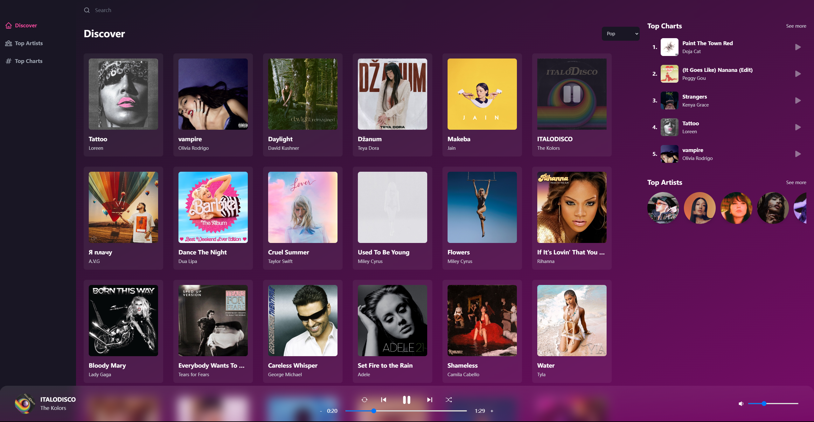

# Audiora: Open Source Music Streaming Web App



**Audiora** is a free, open-source music streaming web app inspired by popular platforms like Spotify and Apple Music. Dive into a vast collection of tracks across genres, explore top charts by genre and artist, and sing along with our lyrics display feature. Experience music like never before!

Visit us: [https://audioraweb.com/](https://audioraweb.com/) (No longer maintained)

## Features

- **Stream by Genre**: Navigate through a diverse range of music genres and find tracks that resonate with your mood.
- **Top Charts**: Discover what's trending! Get the most popular charts curated by genre and artist.
- **Lyrics Display**: Sing along to your favorite tracks with our integrated lyrics viewer.
- **Song Search & Recommendations**: Find that song you've been humming and explore related song recommendations.

## Tech Stack

- **Frontend**: React, Tailwind CSS, Redux
- **Backend**: Node.js
- **APIs**: Rapid API

## Getting Started

### Prerequisites

- Node.js
- npm or yarn

### Installation

1. Clone the repository:
```
git clone https://github.com/kennyzhang0819/Audiora.git
```

2. Navigate to the directory:
```
cd audiora
```

3. Install the dependencies:
```
npm install
```

4. Start the development server:
```
npm start
```

Visit `http://localhost:3000` to see the app in action.

## Contribution

Audiora welcomes contributions from the community. Whether it's a bug fix, feature enhancement, or new design!

## Acknowledgements

- The entire **Audiora** team and contributors for making this project possible.
- Platforms like Spotify and Apple Music for the inspiration.
- Rapid API for providing necessary endpoints.
